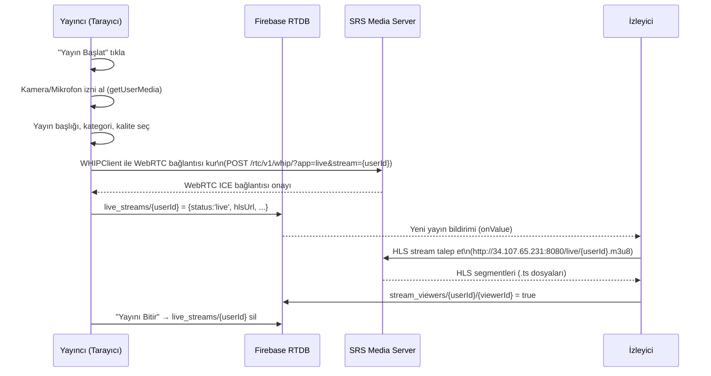
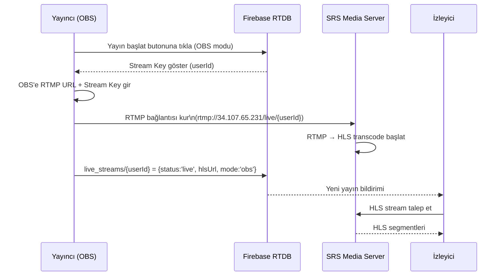

# Tasarım Belgesi: Canlı Yayın Sistemi (live-streaming-system)

## Genel Bakış

Nature.co platformu için tam kapsamlı bir canlı yayın sistemi. Yayıncılar hem tarayıcıdan (WebRTC → SRS → HLS) hem de OBS üzerinden (RTMP → SRS → HLS) yayın yapabilir. İzleyiciler HLS protokolü ile sınırsız sayıda eş zamanlı olarak yayını takip edebilir. Sistem, mevcut SRS Media Server altyapısını (Google Cloud Frankfurt, 34.107.65.231) ve Firebase Realtime Database'i kullanır.

Mevcut `LiveSection.tsx` bileşeni kısmen SRS entegrasyonuna sahip olmakla birlikte, tarayıcıdan WebRTC → RTMP köprüsü eksik, OBS akışı için ayrı bir kurulum akışı yok ve yayın listesi/sohbet deneyimi iyileştirme gerektiriyor. Bu tasarım, bu boşlukları kapatır.

---

## Mimari

```mermaid
graph TD
    subgraph Yayıncı
        A1[Tarayıcı - WebRTC] -->|getUserMedia / getDisplayMedia| B1[WHIPClient]
        A2[OBS - RTMP] -->|rtmp://34.107.65.231/live| C
    end

    subgraph SRS_Media_Server["SRS Media Server (34.107.65.231)"]
        B1 -->|WHIP / WebRTC| C[SRS Core]
        C -->|HLS Transcode| D[HLS Segmenter]
        D -->|.m3u8 + .ts| E[HLS CDN Path]
    end

    subgraph İzleyici
        E -->|http://34.107.65.231:8080/live/{userId}.m3u8| F1[HLS.js Player]
        E -->|Native HLS - Safari| F2[Safari Video]
    end

    subgraph Firebase_RTDB["Firebase Realtime Database"]
        G1[live_streams/{userId}]
        G2[stream_chat/{streamId}]
        G3[stream_viewers/{streamId}]
    end

    B1 -.->|Yayın durumu yaz| G1
    A2 -.->|Yayın durumu yaz - manuel| G1
    F1 -.->|İzleyici kaydı| G3
    F1 -.->|Sohbet mesajları| G2
```

---

## Sıralı Akış Diyagramları

### Seçenek 1: Tarayıcıdan Yayın (WebRTC → SRS → HLS)



### Seçenek 2: OBS ile Yayın (RTMP → SRS → HLS)



---

## Bileşenler ve Arayüzler

### 1. LiveStreamingService (src/services/liveStreamingService.ts)

**Amaç**: Yayın yaşam döngüsünü, Firebase yazma işlemlerini ve SRS iletişimini yönetir.

**Arayüz**:
```typescript
interface StreamMetadata {
  uid: string
  username: string
  title: string
  category: string
  mode: 'browser_camera' | 'browser_screen' | 'browser_screen_cam' | 'obs'
  quality: '360p' | '720p' | '1080p'
  status: 'live' | 'ended'
  started_at: number
  hlsUrl: string
  streamKey: string
  viewerCount?: number
}

interface LiveStreamingService {
  startBrowserStream(userId: string, metadata: Omit<StreamMetadata, 'uid' | 'status' | 'started_at' | 'hlsUrl' | 'streamKey'>): Promise<void>
  startOBSStream(userId: string, metadata: Omit<StreamMetadata, 'uid' | 'status' | 'started_at' | 'hlsUrl' | 'streamKey' | 'mode'>): Promise<{ rtmpUrl: string; streamKey: string }>
  stopStream(userId: string): Promise<void>
  getActiveStreams(): Observable<StreamMetadata[]>
  updateStreamTitle(userId: string, title: string): Promise<void>
}
```

**Sorumluluklar**:
- Firebase `live_streams/{userId}` düğümüne yayın meta verisi yazar
- `onDisconnect` ile bağlantı koptuğunda yayını otomatik sonlandırır
- HLS URL'ini `${SRS_HLS_BASE}${userId}.m3u8` formatında üretir

---

### 2. WHIPClient (src/services/whipClient.ts)

**Amaç**: Tarayıcıdan SRS'e WebRTC bağlantısı kurar. WHIP (WebRTC-HTTP Ingestion Protocol) kullanır.

**Arayüz**:
```typescript
interface WHIPClient {
  connect(stream: MediaStream, streamKey: string): Promise<void>
  disconnect(): void
  onConnectionStateChange(callback: (state: RTCPeerConnectionState) => void): void
}
```

**WHIP Endpoint**: `http://34.107.65.231:1985/rtc/v1/whip/?app=live&stream={streamKey}`

**Sorumluluklar**:
- `RTCPeerConnection` oluşturur, MediaStream track'lerini ekler
- SRS WHIP endpoint'ine HTTP POST ile SDP offer gönderir
- SDP answer alır, ICE negotiation tamamlar
- Bağlantı koptuğunda yeniden bağlanma dener (max 3 deneme)

---

### 3. HLSPlayer (src/components/HLSPlayer.tsx)

**Amaç**: HLS.js veya native HLS ile yayın oynatır.

**Arayüz**:
```typescript
interface HLSPlayerProps {
  hlsUrl: string
  autoPlay?: boolean
  muted?: boolean
  onError?: (error: HlsError) => void
  onReady?: () => void
  className?: string
}
```

**Sorumluluklar**:
- Safari'de native HLS, diğer tarayıcılarda HLS.js kullanır
- Ağ hatalarında otomatik yeniden bağlanır
- Düşük gecikme modu (`lowLatencyMode: true`) ile çalışır
- Yükleniyor/hata durumlarını görsel olarak gösterir

---

### 4. StreamSetupWizard (src/components/StreamSetupWizard.tsx)

**Amaç**: Yayın başlatma akışını adım adım yönetir.

**Arayüz**:
```typescript
interface StreamSetupWizardProps {
  userId: string
  username: string
  onStreamStart: (metadata: StreamMetadata) => void
  onCancel: () => void
  theme: Theme
}

type SetupStep = 'method_select' | 'permission' | 'configure' | 'obs_setup' | 'preview'
```

**Adımlar**:
1. `method_select`: Tarayıcıdan mı OBS ile mi yayın yapılacak seçimi
2. `permission`: Kamera/mikrofon izni (sadece tarayıcı modu)
3. `configure`: Başlık, kategori, kalite, cihaz seçimi
4. `obs_setup`: OBS için RTMP URL + Stream Key gösterimi + OBS indirme linki
5. `preview`: Kamera önizlemesi + "Yayına Geç" butonu

---

### 5. StreamList (src/components/StreamList.tsx)

**Amaç**: Aktif yayınları listeler, seçim yapılmasını sağlar.

**Arayüz**:
```typescript
interface StreamListProps {
  streams: StreamMetadata[]
  selectedStreamId: string | null
  onSelect: (stream: StreamMetadata) => void
  currentUserId: string
}
```

---

### 6. StreamChat (src/components/StreamChat.tsx)

**Amaç**: Yayın sırasında gerçek zamanlı sohbet.

**Arayüz**:
```typescript
interface StreamChatProps {
  streamId: string
  userId: string
  username: string
  isStreamer: boolean
  theme: Theme
}

interface ChatMessage {
  id: string
  uid: string
  user: string
  text: string
  ts: number
  isModerator?: boolean
}
```

---

## Veri Modelleri (Firebase RTDB)

### live_streams/{userId}

```typescript
interface LiveStreamRecord {
  uid: string                    // Yayıncı Firebase UID
  username: string               // Görünen ad
  title: string                  // Yayın başlığı (max 100 karakter)
  category: string               // Kategori
  mode: 'browser_camera' | 'browser_screen' | 'browser_screen_cam' | 'obs'
  quality: '360p' | '720p' | '1080p'
  status: 'live'                 // Sadece 'live' kayıtlar tutulur, bitince silinir
  started_at: number             // Unix timestamp (ms)
  hlsUrl: string                 // http://34.107.65.231:8080/live/{userId}.m3u8
  streamKey: string              // userId ile aynı
  viewerCount: number            // Anlık izleyici sayısı
}
```

### stream_chat/{streamId}/{messageId}

```typescript
interface StreamChatMessage {
  uid: string       // Gönderen Firebase UID
  user: string      // Görünen ad
  text: string      // Mesaj içeriği (max 500 karakter)
  ts: number        // Unix timestamp (ms)
}
```

### stream_viewers/{streamId}/{viewerId}

```typescript
// Değer: true (presence tracking)
// onDisconnect ile otomatik silinir
```

---

## Algoritma: Tarayıcıdan Yayın Başlatma

```pascal
PROCEDURE startBrowserStream(userId, streamTitle, streamMode, quality, selectedCam, selectedMic)
  INPUT: userId, streamTitle, streamMode, quality, selectedCam, selectedMic
  OUTPUT: void (yayın başlar veya hata fırlatır)

  SEQUENCE
    // Adım 1: İzin kontrolü
    IF permissionState ≠ 'granted' THEN
      CALL requestMediaPermissions()
      IF permissionState = 'denied' THEN
        THROW PermissionDeniedError
      END IF
    END IF

    // Adım 2: MediaStream al
    constraints ← buildMediaConstraints(streamMode, quality, selectedCam, selectedMic)
    localStream ← await navigator.mediaDevices.getUserMedia(constraints)

    IF streamMode IN ['screen', 'screen_cam'] THEN
      screenStream ← await navigator.mediaDevices.getDisplayMedia({video: true, audio: true})
      IF streamMode = 'screen_cam' THEN
        localStream ← mergeStreams(localStream, screenStream)
      ELSE
        localStream ← screenStream
      END IF
    END IF

    // Adım 3: WHIP ile SRS'e bağlan
    whipClient ← new WHIPClient()
    await whipClient.connect(localStream, userId)

    // Adım 4: Firebase'e yayın kaydı yaz
    streamData ← {
      uid: userId,
      title: streamTitle,
      mode: streamMode,
      quality: quality,
      status: 'live',
      started_at: Date.now(),
      hlsUrl: SRS_HLS_BASE + userId + '.m3u8',
      streamKey: userId
    }
    await firebase.set('live_streams/' + userId, streamData)
    await firebase.onDisconnect('live_streams/' + userId).remove()

    ASSERT firebase.exists('live_streams/' + userId) = true
    ASSERT whipClient.connectionState = 'connected'
  END SEQUENCE
END PROCEDURE
```

**Ön koşullar**:
- `permissionState` = 'granted' veya izin alınabilir durumda
- `streamTitle` boş değil (min 1 karakter)
- SRS Media Server erişilebilir (34.107.65.231:1985)

**Son koşullar**:
- Firebase `live_streams/{userId}` kaydı oluşturulmuş
- `onDisconnect` ile otomatik temizleme ayarlanmış
- WHIPClient bağlantısı kurulmuş, video akışı SRS'e gidiyor

---

## Algoritma: OBS Yayın Kurulumu

```pascal
PROCEDURE setupOBSStream(userId, streamTitle, category)
  INPUT: userId, streamTitle, category
  OUTPUT: { rtmpUrl, streamKey }

  SEQUENCE
    streamKey ← userId  // Firebase UID stream key olarak kullanılır
    rtmpUrl ← 'rtmp://34.107.65.231/live'

    // Firebase'e 'pending' durumunda kayıt yaz
    // SRS, RTMP bağlantısı gelince 'live' olarak güncellenir
    // Alternatif: Kullanıcı OBS'i bağladıktan sonra manuel "Yayın Aktif" der
    streamData ← {
      uid: userId,
      title: streamTitle,
      category: category,
      mode: 'obs',
      status: 'live',
      started_at: Date.now(),
      hlsUrl: SRS_HLS_BASE + userId + '.m3u8',
      streamKey: streamKey
    }
    await firebase.set('live_streams/' + userId, streamData)
    await firebase.onDisconnect('live_streams/' + userId).remove()

    RETURN { rtmpUrl, streamKey }
  END SEQUENCE
END PROCEDURE
```

---

## Algoritma: HLS Player Bağlantısı

```pascal
PROCEDURE connectHLSPlayer(videoElement, hlsUrl)
  INPUT: videoElement (HTMLVideoElement), hlsUrl (string)
  OUTPUT: void

  SEQUENCE
    IF videoElement.canPlayType('application/vnd.apple.mpegurl') ≠ '' THEN
      // Safari native HLS
      videoElement.src ← hlsUrl
      await videoElement.play()
    ELSE IF Hls.isSupported() THEN
      hls ← new Hls({
        lowLatencyMode: true,
        backBufferLength: 30,
        maxBufferLength: 20
      })
      hls.loadSource(hlsUrl)
      hls.attachMedia(videoElement)

      ON hls.MANIFEST_PARSED DO
        await videoElement.play()
      END ON

      ON hls.ERROR DO (event, data)
        IF data.fatal THEN
          IF data.type = NETWORK_ERROR THEN
            hls.startLoad()  // Yeniden dene
          ELSE IF data.type = MEDIA_ERROR THEN
            hls.recoverMediaError()
          END IF
        END IF
      END ON
    ELSE
      THROW HLSNotSupportedError
    END IF
  END SEQUENCE
END PROCEDURE
```

---

## Hata Yönetimi

### Hata Senaryosu 1: Kamera/Mikrofon İzni Reddedildi

**Koşul**: `navigator.mediaDevices.getUserMedia()` `NotAllowedError` fırlatır
**Yanıt**: Kullanıcıya tarayıcı ayarlarından izin vermesi için adım adım rehber gösterilir
**Kurtarma**: Kullanıcı izin verdikten sonra "Tekrar Dene" butonu ile akış yeniden başlatılır

### Hata Senaryosu 2: SRS WHIP Bağlantısı Kurulamıyor

**Koşul**: WHIPClient `connect()` başarısız olur (network hatası veya SRS kapalı)
**Yanıt**: "Yayın sunucusuna bağlanılamadı" hatası gösterilir, OBS alternatifi önerilir
**Kurtarma**: 3 saniye bekleyip max 3 kez otomatik yeniden deneme

### Hata Senaryosu 3: HLS Stream Yüklenemiyor

**Koşul**: HLS.js `NETWORK_ERROR` veya `MEDIA_ERROR` fırlatır
**Yanıt**: "Yayın yüklenemiyor, yeniden bağlanılıyor..." mesajı gösterilir
**Kurtarma**: `hls.startLoad()` veya `hls.recoverMediaError()` ile otomatik kurtarma

### Hata Senaryosu 4: Cihaz Bağlantısı Kesildi

**Koşul**: `navigator.mediaDevices` `devicechange` eventi, aktif track `readyState === 'ended'`
**Yanıt**: Sarı uyarı banner'ı gösterilir: "Bir cihaz bağlantısı kesildi"
**Kurtarma**: Kullanıcı ayarlar panelinden yeni cihaz seçer (hot-swap)

### Hata Senaryosu 5: Yayıncı Bağlantısı Koptu

**Koşul**: Yayıncı tarayıcıyı kapatır veya internet bağlantısı kesilir
**Yanıt**: Firebase `onDisconnect` tetiklenir, `live_streams/{userId}` silinir
**Kurtarma**: İzleyiciler "Yayın sona erdi" mesajı görür, yayın listesine yönlendirilir

---

## Test Stratejisi

### Birim Testleri

- `WHIPClient.connect()`: Mock RTCPeerConnection ile SDP offer/answer akışı
- `LiveStreamingService.startBrowserStream()`: Firebase mock ile kayıt yazma doğrulaması
- `HLSPlayer`: HLS.js mock ile hata kurtarma senaryoları
- `StreamSetupWizard`: Her adım geçişi ve validasyon kuralları

### Özellik Tabanlı Testler (Property-Based Testing)

**Test Kütüphanesi**: fast-check

- Her geçerli `StreamMetadata` için `hlsUrl` her zaman `{SRS_HLS_BASE}{userId}.m3u8` formatında olmalı
- `streamKey` her zaman `userId` ile eşit olmalı
- Yayın başlatıldığında Firebase kaydı her zaman `status: 'live'` içermeli
- Yayın bittiğinde Firebase kaydı her zaman silinmeli (onDisconnect)

### Entegrasyon Testleri

- Tarayıcı → SRS WHIP → HLS izleyici tam akışı (staging ortamında)
- OBS → SRS RTMP → HLS izleyici tam akışı
- Firebase presence tracking: izleyici sayısı doğruluğu
- Çoklu eş zamanlı yayın senaryosu

---

## Performans Değerlendirmeleri

- **HLS Gecikme**: SRS varsayılan HLS gecikme ~3-5 saniye. `lowLatencyMode` ile HLS.js tarafında ~2-3 saniyeye düşürülebilir.
- **WHIP Bağlantısı**: WebRTC ICE negotiation ~500ms-2s sürer. Kullanıcıya "Bağlanıyor..." göstergesi gerekli.
- **İzleyici Ölçeklenebilirliği**: SRS HLS ile 10.000+ eş zamanlı izleyici desteklenir. Firebase RTDB sohbet için mesaj sayısı son 200 ile sınırlandırılmalı.
- **Video Kalitesi**: 720p önerilen kalite. 1080p için yayıncının 10+ Mbps upload hızı gerekli.
- **Firebase Okuma Maliyeti**: `stream_viewers` presence tracking her bağlantı/kopma için yazma yapar. Büyük izleyici sayılarında Firebase Blaze planına geçiş gerekebilir.

---

## Güvenlik Değerlendirmeleri

- **Stream Key = userId**: Yayıncı kendi userId'si ile yayın yapar. Başkasının stream key'ini kullanarak yayın yapılamaz (Firebase kuralları `uid === auth.uid` doğrular).
- **HTTPS Zorunluluğu**: `getUserMedia` API'si sadece HTTPS veya localhost'ta çalışır. Production ortamında HTTPS zorunlu.
- **Sohbet Moderasyonu**: Mevcut `is_banned` kuralı `stream_chat` için de geçerli. Yasaklı kullanıcılar mesaj gönderemez.
- **RTMP Güvenliği**: SRS RTMP endpoint'i herkese açık. Stream key olarak userId kullanılması, başkasının yayınını ele geçirmeyi zorlaştırır ancak tam güvenlik için SRS token auth yapılandırması önerilir (gelecek iterasyon).
- **XSS Koruması**: Sohbet mesajları React'ın varsayılan escape mekanizması ile korunur, `dangerouslySetInnerHTML` kullanılmaz.

---

## Bağımlılıklar

| Paket | Versiyon | Kullanım |
|-------|----------|----------|
| `hls.js` | ^1.x | HLS stream oynatma (mevcut, kurulu) |
| `firebase` | ^10.x | Realtime Database, Auth (mevcut, kurulu) |
| `react` | ^18.x | UI framework (mevcut, kurulu) |
| `lucide-react` | ^0.x | İkonlar (mevcut, kurulu) |

**Yeni bağımlılık gerekmez.** WHIP protokolü native `RTCPeerConnection` ve `fetch` API ile implemente edilir.

---

## Mevcut Koddan Değişiklikler

### Korunacaklar (LiveSection.tsx'ten)
- `AudioMeter` bileşeni (ses seviyesi göstergesi)
- `StreamTimer` bileşeni (yayın süresi sayacı)
- Cihaz yönetimi mantığı (`refreshDevices`, `hotSwapDevice`)
- Firebase sohbet ve izleyici sayısı mantığı
- HLS.js entegrasyonu (`connectToHLS`)
- Mevcut UI tasarım dili (dark theme, Tailwind sınıfları)

### Değiştirilecekler
- WebRTC P2P yayın modu → WHIP tabanlı SRS yayın modu
- Setup wizard'a OBS modu adımı eklenmesi
- Yayın listesine HLS player entegrasyonu (mevcut `viewerVideoRef` WebRTC yerine HLS kullanacak)
- `useMediaServer` toggle kaldırılacak (artık her zaman SRS kullanılır)

### Eklenecekler
- `WHIPClient` servisi (yeni dosya)
- OBS kurulum ekranı (RTMP URL + Stream Key + OBS indirme linki)
- Yayın başlangıcında SRS'e WHIP bağlantısı


---

## Doğruluk Özellikleri

*Bir özellik (property), sistemin tüm geçerli çalışmalarında doğru olması gereken bir karakteristik veya davranıştır. Özellikler, insan tarafından okunabilir spesifikasyonlar ile makine tarafından doğrulanabilir doğruluk garantileri arasındaki köprüyü oluşturur.*

### Özellik 1: HLS URL Formatı

*Herhangi bir* geçerli userId değeri için, `LiveStreamingService` tarafından üretilen HLS URL'i her zaman `http://34.107.65.231:8080/live/{userId}.m3u8` formatında olmalıdır.

**Doğrular: Gereksinim 1.9**

---

### Özellik 2: StreamKey ve userId Özdeşliği

*Herhangi bir* yayın başlatma işlemi (tarayıcı veya OBS modu) için, üretilen StreamKey değeri her zaman yayıncının userId değeri ile özdeş olmalıdır.

**Doğrular: Gereksinimler 2.4, 10.1**

---

### Özellik 3: Yayın Başlatıldığında Firebase Kaydı

*Herhangi bir* geçerli StreamMetadata ile yayın başlatıldığında, Firebase `live_streams/{userId}` düğümünde `status: 'live'` içeren bir kayıt oluşturulmalıdır.

**Doğrular: Gereksinimler 1.7, 2.3, 5.1, 5.2**

---

### Özellik 4: Yayın Sonlandırıldığında Firebase Kaydı Silinir

*Herhangi bir* yayın sonlandırma işleminde (kullanıcı tarafından veya bağlantı kopması ile), Firebase `live_streams/{userId}` kaydı silinmeli ve tüm MediaStream track'leri ile WHIPClient bağlantısı kapatılmalıdır.

**Doğrular: Gereksinimler 5.3, 11.1, 11.2, 11.3**

---

### Özellik 5: onDisconnect Mekanizması

*Herhangi bir* yayın başlatma işleminde, `live_streams/{userId}` düğümü için `onDisconnect().remove()` her zaman ayarlanmalıdır; böylece yayıncının bağlantısı beklenmedik şekilde koptuğunda kayıt otomatik silinir.

**Doğrular: Gereksinimler 1.8, 5.4**

---

### Özellik 6: WHIPClient Yeniden Deneme Sınırı

*Herhangi bir* bağlantı hatası senaryosunda, WHIPClient yeniden deneme sayısı hiçbir zaman 3'ü geçmemelidir.

**Doğrular: Gereksinim 3.4**

---

### Özellik 7: StreamMetadata Zorunlu Alanlar

*Herhangi bir* geçerli yayın başlatma işleminde oluşturulan StreamMetadata nesnesi, `uid`, `username`, `title`, `category`, `mode`, `quality`, `status`, `started_at`, `hlsUrl` ve `streamKey` alanlarının tamamını içermelidir.

**Doğrular: Gereksinimler 5.1, 12.1**

---

### Özellik 8: StreamMetadata Round-Trip (Serileştirme)

*Herhangi bir* geçerli StreamMetadata nesnesi için, nesneyi Firebase'e yazıp okumak eşdeğer bir nesne üretmelidir (round-trip özelliği).

**Doğrular: Gereksinimler 12.2, 12.3**

---

### Özellik 9: Geçersiz StreamMetadata Filtreleme

*Herhangi bir* eksik zorunlu alan içeren Firebase kaydı için, `LiveStreamingService` bu kaydı yayın listesinde göstermemelidir.

**Doğrular: Gereksinim 12.4**

---

### Özellik 10: Kalite Seçimine Göre Video Kısıtlamaları

*Herhangi bir* kalite seçimi (360p, 720p, 1080p) için, `LiveStreamingService` tarafından uygulanan video kısıtlamaları seçilen kaliteye karşılık gelen çözünürlük değerlerini (sırasıyla 640×360, 1280×720, 1920×1080) içermelidir.

**Doğrular: Gereksinimler 9.2, 9.3, 9.4**

---

### Özellik 11: Sohbet Mesajı Uzunluk Sınırı

*Herhangi bir* 500 karakterden uzun mesaj içeriği için, `StreamChat` mesaj gönderme işlemini reddetmeli ve sohbet durumu değişmemelidir.

**Doğrular: Gereksinim 6.2**

---

### Özellik 12: Sohbet Mesajı Listesi Sınırı

*Herhangi bir* sohbet oturumunda, görüntülenen mesaj sayısı hiçbir zaman 200'ü geçmemelidir.

**Doğrular: Gereksinimler 6.4, 9.6**

---

### Özellik 13: Yasaklı Kullanıcı Mesaj Engeli

*Herhangi bir* `is_banned: true` olan kullanıcı için, `StreamChat` mesaj gönderme işlemini reddetmeli ve Firebase'e yazma yapılmamalıdır.

**Doğrular: Gereksinimler 6.5, 10.5**

---

### Özellik 14: İzleyici Sayısı Doğruluğu

*Herhangi bir* yayın oturumunda, görüntülenen izleyici sayısı Firebase `stream_viewers/{streamId}` düğümündeki kayıt sayısı ile eşit olmalıdır.

**Doğrular: Gereksinim 7.3**

---

### Özellik 15: Yayıncı İzleyici Listesinde Yer Almaz

*Herhangi bir* yayıncı için, `stream_viewers/{streamId}` düğümünde yayıncının kendi userId'si ile bir kayıt bulunmamalıdır.

**Doğrular: Gereksinim 7.4**

---

### Özellik 16: Hot-Swap Sonrası Eski Track Durur

*Herhangi bir* yayın sırasında gerçekleştirilen cihaz değişiminde (kamera veya mikrofon), eski MediaStreamTrack'in `readyState` değeri `'ended'` olmalı ve yeni track aktif akışa eklenmiş olmalıdır.

**Doğrular: Gereksinimler 8.4, 8.5**

---

### Özellik 17: Yayın Başlığı Uzunluk Sınırı

*Herhangi bir* 100 karakterden uzun yayın başlığı için, `LiveStreamingService` başlığı reddetmeli veya kırpmalıdır.

**Doğrular: Gereksinim 5.7**

---

### Özellik 18: HTTPS Zorunluluğu

*Herhangi bir* HTTP (HTTPS olmayan) bağlantıda, `LiveStreamingService` kamera/mikrofon izni talep etmemeli ve kullanıcıya HTTPS zorunluluğunu bildirmelidir.

**Doğrular: Gereksinim 10.3**
