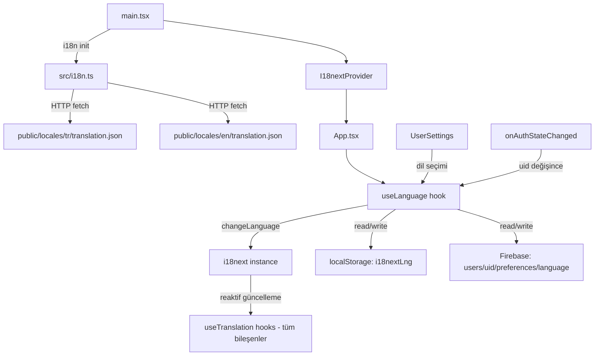
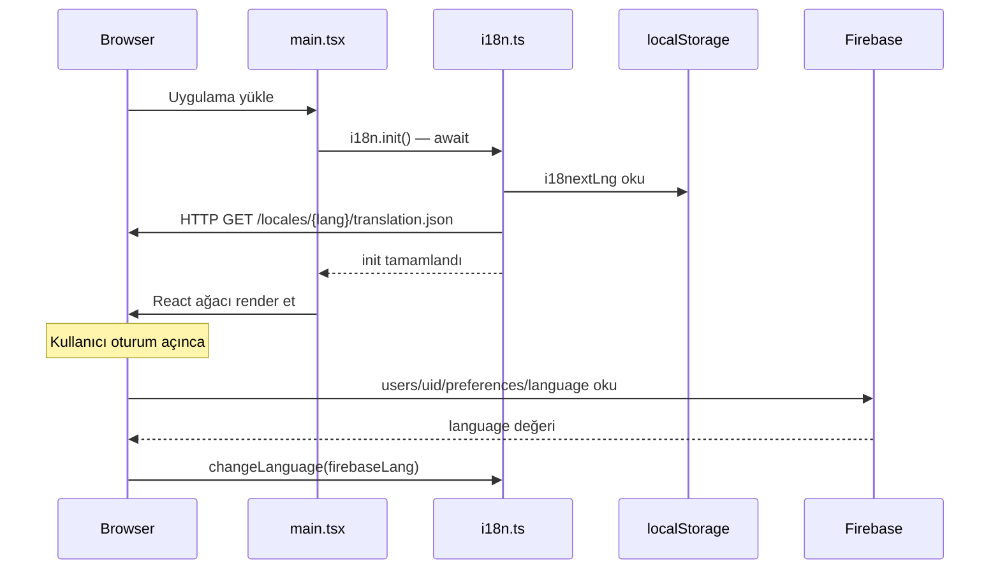

# Tasarım Belgesi: Çoklu Dil Desteği (Multi-Language Support)

## Genel Bakış

Nature.co uygulamasına i18next + react-i18next altyapısı kullanılarak Türkçe (tr) ve İngilizce (en) dil desteği eklenecektir. Şu anda 80+ bileşende hardcoded Türkçe string bulunmaktadır; bu tasarım, tüm UI metinlerini çeviri anahtarlarına dönüştürme stratejisini, dil tercihinin kalıcı saklanmasını ve anlık dil değişikliği mekanizmasını tanımlar.

Temel kararlar:
- **i18next-http-backend** ile locale dosyaları `public/locales/` altından HTTP üzerinden yüklenir (bundle boyutunu artırmaz).
- **Namespace tabanlı organizasyon**: 10 namespace (`common`, `auth`, `chat`, `forum`, `dm`, `friends`, `admin`, `settings`, `live`, `profile`) ile çeviri dosyaları modüler tutulur.
- **Tek translation.json per dil**: Tüm namespace'ler tek dosyada iç içe nesne olarak saklanır; bu, HTTP istek sayısını minimize eder.
- **useLanguage custom hook**: Firebase senkronizasyonu ve dil değişikliği mantığı tek noktada kapsüllenir.

---

## Mimari



### Başlatma Akışı



---

## Bileşenler ve Arayüzler

### 1. `src/i18n.ts` — i18next Konfigürasyonu

```typescript
import i18n from 'i18next';
import { initReactI18next } from 'react-i18next';
import LanguageDetector from 'i18next-browser-languagedetector';
import HttpBackend from 'i18next-http-backend';

i18n
  .use(HttpBackend)
  .use(LanguageDetector)
  .use(initReactI18next)
  .init({
    fallbackLng: 'tr',
    supportedLngs: ['tr', 'en'],
    defaultNS: 'translation',
    backend: {
      loadPath: '/locales/{{lng}}/translation.json',
    },
    detection: {
      order: ['localStorage', 'navigator'],
      caches: ['localStorage'],
      lookupLocalStorage: 'i18nextLng',
    },
    interpolation: { escapeValue: false },
    react: { useSuspense: true },
  });

export default i18n;
```

**Önemli**: `main.tsx` içinde React render öncesinde `import './i18n'` ile yüklenir.

### 2. `src/hooks/useLanguage.ts` — Custom Hook

```typescript
interface UseLanguageReturn {
  language: 'tr' | 'en';
  changeLanguage: (lang: 'tr' | 'en') => Promise<void>;
  isChanging: boolean;
}
```

Sorumluluklar:
- `i18next.changeLanguage()` çağrısı
- `localStorage` güncelleme (`i18nextLng`)
- Firebase `users/{uid}/preferences/language` yazma (oturum açıksa)
- `document.documentElement.lang` güncelleme
- Firebase hata durumunda sessiz devam (localStorage yeterli)

### 3. `UserSettings` — Dil Seçici Bölümü

Mevcut `UserSettings` bileşenine yeni bir `'language'` tab'ı eklenir:

```typescript
// TABS dizisine eklenir:
{ id: 'language', label: t('settings.language.tab'), icon: Globe }
```

Dil seçici UI:
- Türkçe: 🇹🇷 bayrak + "Türkçe" etiketi
- İngilizce: 🇬🇧 bayrak + "English" etiketi
- Aktif dil: `emerald-500` border + arka plan vurgusu
- Tıklamada `useLanguage().changeLanguage()` çağrısı

### 4. Firebase Entegrasyonu

`useLanguage` hook'u içinde, `auth.currentUser` mevcutsa:

```typescript
// Yazma — sadece language alanını güncelle (merge)
await update(ref(db, `users/${uid}/preferences`), { language: lang });

// Okuma — onAuthStateChanged tetiklenince
const snap = await get(ref(db, `users/${uid}/preferences`));
const firebaseLang = snap.val()?.language;
if (firebaseLang) await i18n.changeLanguage(firebaseLang);
```

`update()` kullanımı `theme`, `compact`, `fontSize` alanlarını korur.

### 5. Bileşenlere `useTranslation` Ekleme Stratejisi

**Öncelik sırası** (etki alanına göre):

| Öncelik | Bileşenler | Namespace |
|---------|-----------|-----------|
| 1 | `AuthPage`, `UserSettings` | `auth`, `settings` |
| 2 | `Sidebar`, `ChannelSidebar`, `ChatArea` | `common`, `chat` |
| 3 | `DirectMessages`, `Forum`, `FriendSystem` | `dm`, `forum`, `friends` |
| 4 | `NotificationCenter`, `ProfilePage` | `common`, `profile` |
| 5 | `AdminPanel` + tüm Admin bileşenleri | `admin` |
| 6 | Kalan 70+ bileşen | ilgili namespace |

**Uygulama paterni** her bileşen için:

```typescript
// Önce
<button>Gönder</button>

// Sonra
import { useTranslation } from 'react-i18next';
const { t } = useTranslation();
<button>{t('common.send')}</button>
```

**Çoğul ifadeler**:
```typescript
t('chat.messageCount', { count: messages.length })
// tr: "{{count}} mesaj" / "{{count}} mesajlar"
// en: "{{count}} message" / "{{count}} messages"
```

**Tarih/saat formatı**:
```typescript
new Intl.DateTimeFormat(i18n.language === 'tr' ? 'tr-TR' : 'en-US', {
  hour: '2-digit', minute: '2-digit'
}).format(date)
```

---

## Veri Modelleri

### Locale Dosyası Yapısı

`public/locales/tr/translation.json` ve `public/locales/en/translation.json` aynı anahtar yapısını paylaşır:

```json
{
  "common": {
    "save": "Kaydet",
    "cancel": "İptal",
    "send": "Gönder",
    "loading": "Yükleniyor...",
    "error": "Bir hata oluştu",
    "search": "Ara",
    "close": "Kapat",
    "delete": "Sil",
    "edit": "Düzenle",
    "confirm": "Onayla"
  },
  "auth": {
    "login": "Giriş Yap",
    "register": "Kayıt Ol",
    "logout": "Çıkış Yap",
    "email": "E-posta",
    "password": "Şifre",
    "forgotPassword": "Şifremi Unuttum",
    "loginError": "Giriş başarısız"
  },
  "chat": {
    "sendMessage": "Mesaj gönder...",
    "messageCount_one": "{{count}} mesaj",
    "messageCount_other": "{{count}} mesaj",
    "pinMessage": "Mesajı Sabitle",
    "deleteMessage": "Mesajı Sil",
    "editMessage": "Mesajı Düzenle",
    "reactions": "Tepkiler"
  },
  "forum": {
    "newPost": "Yeni Gönderi",
    "reply": "Yanıtla",
    "like": "Beğen",
    "share": "Paylaş"
  },
  "dm": {
    "newMessage": "Yeni Mesaj",
    "noConversations": "Henüz konuşma yok",
    "typeMessage": "Mesaj yaz..."
  },
  "friends": {
    "addFriend": "Arkadaş Ekle",
    "removeFriend": "Arkadaşlıktan Çıkar",
    "pendingRequests": "Bekleyen İstekler",
    "online": "Çevrimiçi"
  },
  "admin": {
    "panel": "Yönetim Paneli",
    "moderation": "Moderasyon",
    "analytics": "Analitik",
    "users": "Kullanıcılar",
    "ban": "Yasakla",
    "unban": "Yasağı Kaldır"
  },
  "settings": {
    "title": "Ayarlar",
    "appearance": "Görünüm",
    "notifications": "Bildirimler",
    "accessibility": "Erişilebilirlik",
    "language": {
      "tab": "Dil / Language",
      "title": "Uygulama Dili",
      "description": "Arayüz dilini seçin",
      "turkish": "Türkçe",
      "english": "English",
      "saved": "Dil tercihi kaydedildi"
    }
  },
  "live": {
    "goLive": "Yayına Başla",
    "watching": "izliyor",
    "streamEnded": "Yayın sona erdi"
  },
  "profile": {
    "editProfile": "Profili Düzenle",
    "followers": "Takipçi",
    "following": "Takip Edilen",
    "posts": "Gönderi"
  }
}
```

### Firebase Veri Modeli

```
users/{uid}/preferences/
  ├── theme: string          (mevcut — dokunulmaz)
  ├── compact: boolean       (mevcut — dokunulmaz)
  ├── fontSize: number       (mevcut — dokunulmaz)
  └── language: 'tr' | 'en' (YENİ — sadece bu alan eklenir)
```

### localStorage Anahtarları

| Anahtar | Değer | Açıklama |
|---------|-------|----------|
| `i18nextLng` | `'tr'` \| `'en'` | i18next'in native detection anahtarı |

---

## Doğruluk Özellikleri

*Bir özellik (property), sistemin tüm geçerli çalışmalarında doğru olması gereken bir karakteristik veya davranıştır — temelde sistemin ne yapması gerektiğine dair biçimsel bir ifadedir. Özellikler, insan tarafından okunabilir spesifikasyonlar ile makine tarafından doğrulanabilir doğruluk garantileri arasındaki köprüyü oluşturur.*

### Özellik 1: Eksik Anahtar Fallback Zinciri

*Herhangi bir* Translation_Key için: aktif dilde bulunamazsa Türkçe karşılığı döndürülmeli; Türkçe'de de bulunamazsa anahtarın kendisi döndürülmelidir. Hiçbir durumda `undefined` veya boş string dönmemelidir.

**Doğrular: Gereksinim 1.6, 1.7**

### Özellik 2: Dil Yükleme Öncelik Sırası

*Herhangi bir* başlatma senaryosunda (Firebase değeri var/yok, localStorage değeri var/yok kombinasyonları): dil yükleme sırası Firebase > localStorage > tarayıcı dili > `tr` olmalıdır. Daha yüksek öncelikli kaynak mevcut olduğunda daha düşük öncelikli kaynak kullanılmamalıdır.

**Doğrular: Gereksinim 2.1**

### Özellik 3: Dil Değişikliği localStorage'a Yansır

*Herhangi bir* geçerli dil değeri (`tr` veya `en`) için: `changeLanguage()` çağrısı sonrasında `localStorage.getItem('i18nextLng')` yeni dil değerini döndürmelidir.

**Doğrular: Gereksinim 2.3**

### Özellik 4: Oturum Durumuna Göre Saklama Hedefi

*Herhangi bir* dil değişikliği için: kullanıcı oturum açmışsa Firebase'e yazılmalı; oturum açmamışsa Firebase'e yazılmamalı (yalnızca localStorage). Bu kural tüm dil değişikliği senaryolarında geçerlidir.

**Doğrular: Gereksinim 2.4, 2.6**

### Özellik 5: Dil Seçici Aktif Dil Vurgusu

*Herhangi bir* aktif dil değeri için: UserSettings dil seçici bölümü her iki seçeneği göstermeli ve yalnızca aktif olan seçenek vurgulanmış (seçili) görünmelidir.

**Doğrular: Gereksinim 3.2, 3.3**

### Özellik 6: Tarih/Saat Locale Formatı

*Herhangi bir* Date nesnesi için: aktif dil `tr` iken `tr-TR` locale, `en` iken `en-US` locale ile formatlanmalıdır. Yanlış locale ile format üretilmemelidir.

**Doğrular: Gereksinim 4.3**

### Özellik 7: Çoğul İfade Doğruluğu

*Herhangi bir* sayısal değer için: i18next `count` interpolasyonu ile üretilen metin, aktif dile uygun çoğul formda olmalıdır (`tr` için sayı bağımsız tek form, `en` için 1 tekil / diğerleri çoğul).

**Doğrular: Gereksinim 4.4**

### Özellik 8: Locale Dosyaları Anahtar Eşitliği

*Her iki* locale dosyası (`tr` ve `en`) aynı Translation_Key kümesini içermelidir. `tr` dosyasında olan her anahtar `en` dosyasında da bulunmalı, tersi de geçerli olmalıdır.

**Doğrular: Gereksinim 6.3**

### Özellik 9: Reaktif Dil Değişikliği

*Herhangi bir* `useTranslation` kullanan bileşen için: `changeLanguage()` çağrısı sonrasında bileşen yeni dildeki metni render etmeli; sayfa yenilemesi gerekmemeli ve geçiş sırasında boş/undefined metin gösterilmemelidir.

**Doğrular: Gereksinim 7.1, 7.2, 7.3**

### Özellik 10: HTML lang Niteliği Güncelleme

*Herhangi bir* dil değişikliği için: `document.documentElement.lang` niteliği yeni dil koduna (`tr` veya `en`) eşit olmalıdır.

**Doğrular: Gereksinim 7.4**

### Özellik 11: Mevcut Tercihler Korunur

*Herhangi bir* kullanıcı için: dil tercihi Firebase'e yazılırken `theme`, `compact`, `fontSize` alanları değişmemelidir. Yazma öncesi ve sonrası bu alanların değerleri aynı kalmalıdır.

**Doğrular: Gereksinim 8.2, 8.3**

---

## Hata Yönetimi

### Firebase Yazma Hatası

```typescript
try {
  await update(ref(db, `users/${uid}/preferences`), { language: lang });
} catch (error) {
  // Sessizce devam et — localStorage zaten güncellendi
  // Geliştirme ortamında console.warn
  if (import.meta.env.DEV) {
    console.warn('[i18n] Firebase dil tercihi kaydedilemedi:', error);
  }
}
```

### Locale Dosyası Yükleme Hatası

i18next-http-backend, yükleme başarısız olursa `fallbackLng` (`tr`) dosyasını kullanır. Eğer o da başarısız olursa Translation_Key'in kendisi döner — uygulama çökmez.

### Eksik Translation_Key (Geliştirme Ortamı)

```typescript
// i18n.ts konfigürasyonuna eklenir:
saveMissing: import.meta.env.DEV,
missingKeyHandler: (lngs, ns, key) => {
  console.warn(`[i18n] Eksik anahtar: ${ns}:${key} (${lngs})`);
},
```

### Geçersiz Dil Değeri

`changeLanguage()` çağrısından önce değer `supportedLngs` listesinde kontrol edilir; geçersizse `'tr'` kullanılır:

```typescript
const safeChange = (lang: string) => {
  const safe = ['tr', 'en'].includes(lang) ? lang : 'tr';
  return i18n.changeLanguage(safe);
};
```

---

## Test Stratejisi

### Birim Testleri (Vitest)

Belirli örnekler ve edge case'ler için:

- `i18n.ts` konfigürasyonu: `fallbackLng`, `supportedLngs`, `detection.order` değerleri
- `useLanguage` hook: Firebase başarısız olduğunda localStorage güncellenir (mock Firebase)
- `useLanguage` hook: Oturum açık değilken Firebase çağrısı yapılmaz
- Locale dosyaları: `tr` ve `en` dosyalarının aynı anahtar kümesini içerdiği
- `UserSettings`: Dil tab'ının render edildiği, her iki seçeneğin gösterildiği

### Property-Based Testler (Vitest + fast-check)

Her property testi minimum 100 iterasyon çalıştırılır. Kullanılan kütüphane: **fast-check** (`fc`).

**Özellik 1 — Eksik Anahtar Fallback Zinciri**
```typescript
// Feature: multi-language-support, Property 1: Eksik anahtar fallback zinciri
fc.assert(fc.asyncProperty(
  fc.string({ minLength: 1 }),
  async (randomKey) => {
    const result = i18n.t(randomKey);
    return result !== undefined && result !== '';
  }
), { numRuns: 100 });
```

**Özellik 3 — localStorage Güncelleme**
```typescript
// Feature: multi-language-support, Property 3: Dil değişikliği localStorage'a yansır
fc.assert(fc.asyncProperty(
  fc.constantFrom('tr', 'en'),
  async (lang) => {
    await changeLanguage(lang);
    return localStorage.getItem('i18nextLng') === lang;
  }
), { numRuns: 100 });
```

**Özellik 8 — Locale Dosyaları Anahtar Eşitliği**
```typescript
// Feature: multi-language-support, Property 8: Locale dosyaları anahtar eşitliği
// tr ve en dosyaları yüklendikten sonra anahtar kümeleri karşılaştırılır
const flatKeys = (obj: object, prefix = ''): string[] => { ... };
fc.assert(fc.property(
  fc.constant(null),
  () => {
    const trKeys = new Set(flatKeys(trTranslation));
    const enKeys = new Set(flatKeys(enTranslation));
    return [...trKeys].every(k => enKeys.has(k)) &&
           [...enKeys].every(k => trKeys.has(k));
  }
), { numRuns: 1 }); // deterministik — 1 yeterli
```

**Özellik 11 — Mevcut Tercihler Korunur**
```typescript
// Feature: multi-language-support, Property 11: Mevcut tercihler korunur
fc.assert(fc.asyncProperty(
  fc.record({
    theme: fc.string(),
    compact: fc.boolean(),
    fontSize: fc.integer({ min: 12, max: 20 }),
  }),
  fc.constantFrom('tr', 'en'),
  async (existingPrefs, newLang) => {
    // Firebase mock'a mevcut prefs yaz
    mockFirebase.set(`users/testUid/preferences`, existingPrefs);
    await changeLanguage(newLang); // sadece language yazar
    const result = mockFirebase.get(`users/testUid/preferences`);
    return result.theme === existingPrefs.theme &&
           result.compact === existingPrefs.compact &&
           result.fontSize === existingPrefs.fontSize;
  }
), { numRuns: 100 });
```

**Özellik 9 — Reaktif Dil Değişikliği**
```typescript
// Feature: multi-language-support, Property 9: Reaktif dil değişikliği
fc.assert(fc.asyncProperty(
  fc.constantFrom('tr', 'en'),
  fc.constantFrom('tr', 'en'),
  async (initialLang, newLang) => {
    await i18n.changeLanguage(initialLang);
    const start = Date.now();
    await i18n.changeLanguage(newLang);
    const elapsed = Date.now() - start;
    return elapsed < 300 && i18n.language === newLang;
  }
), { numRuns: 100 });
```

### Test Dosyası Konumu

```
src/services/__tests__/
  i18n.test.ts          — i18n konfigürasyon birim testleri
  useLanguage.test.ts   — hook birim + property testleri
  localeKeys.test.ts    — locale dosyaları anahtar eşitliği
```
