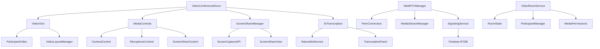
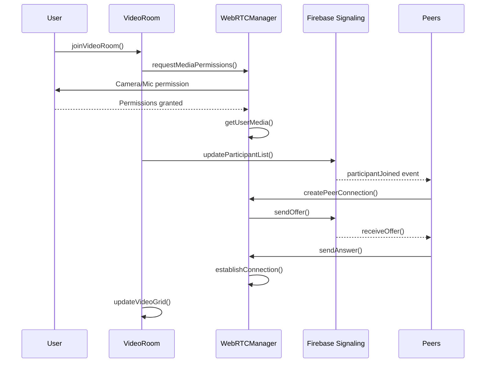
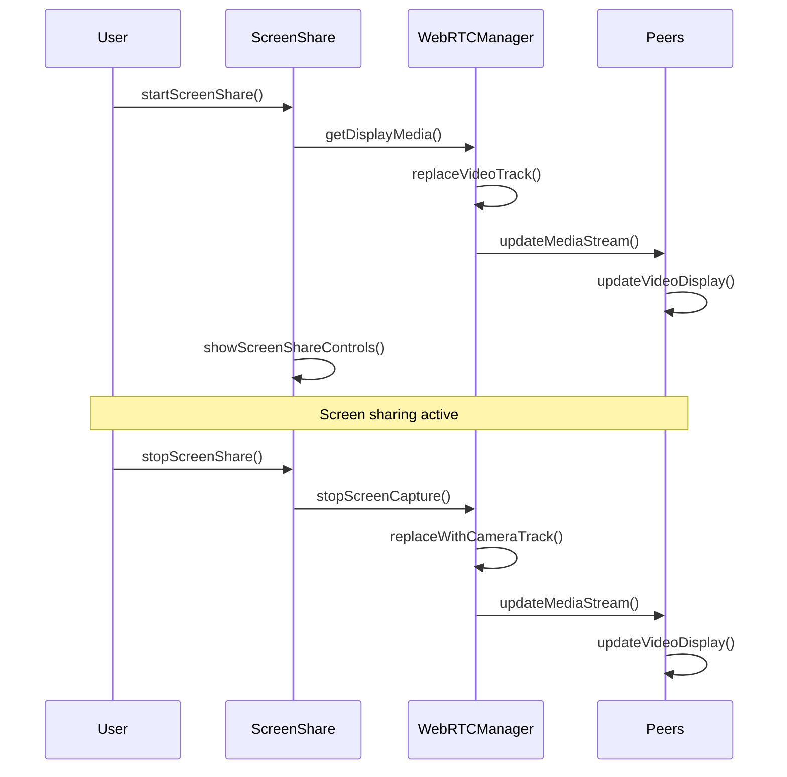

# Design Document: Video Conference Rooms

## Overview

Video Conference Rooms özelliği, mevcut VoiceRooms sistemini genişleterek grup video konferans yetenekleri ekler. Bu özellik, kullanıcıların sesli odalarında kamera açabilmelerini, video grid layout'unda birbirlerini görebilmelerini, ekran paylaşımı yapabilmelerini ve AI moderasyon ile transkripsiyon özelliklerinden faydalanabilmelerini sağlar. WebRTC tabanlı P2P bağlantı kullanarak düşük gecikme ve yüksek kaliteli video iletişimi sunar.

Sistem, mevcut VoiceRooms altyapısını koruyarak geriye dönük uyumluluğu sağlar ve aşamalı geçiş imkanı sunar. Firebase Realtime Database signaling ile WebRTC bağlantıları kurulur, React hooks ile media yönetimi yapılır ve responsive video grid layout ile farklı ekran boyutlarında optimal görüntüleme deneyimi sağlanır.

## Architecture



## Sequence Diagrams

### Video Room Join Flow



### Screen Share Flow



## Components and Interfaces

### VideoConferenceRoom Component

**Purpose**: Ana video konferans odası bileşeni, tüm video konferans özelliklerini koordine eder

**Interface**:
```pascal
INTERFACE VideoConferenceRoom
  PROPERTIES
    roomId: String
    userId: String
    username: String
    avatar: String (optional)
    onLeave: Function
    theme: Object
  
  METHODS
    PROCEDURE initialize()
    PROCEDURE joinRoom()
    PROCEDURE leaveRoom()
    PROCEDURE updateLayout()
    PROCEDURE handleParticipantChange()
END INTERFACE
```

**Responsibilities**:
- Video grid layout yönetimi
- Katılımcı durumu takibi
- Media kontrollerinin koordinasyonu
- AI özelliklerinin entegrasyonu

### VideoGrid Component

**Purpose**: Katılımcıların video akışlarını grid layout'unda düzenler

**Interface**:
```pascal
INTERFACE VideoGrid
  PROPERTIES
    participants: Array<VideoParticipant>
    layout: GridLayout
    maxParticipants: Integer
    screenShareActive: Boolean
  
  METHODS
    PROCEDURE calculateLayout()
    PROCEDURE renderParticipants()
    PROCEDURE handleResize()
    PROCEDURE optimizeForScreenShare()
END INTERFACE
```

**Responsibilities**:
- Dinamik grid layout hesaplama
- Video akışlarının render edilmesi
- Responsive tasarım uygulaması
- Ekran paylaşımı için layout optimizasyonu

### MediaControls Component

**Purpose**: Kamera, mikrofon ve ekran paylaşımı kontrollerini sağlar

**Interface**:
```pascal
INTERFACE MediaControls
  PROPERTIES
    isCameraOn: Boolean
    isMicOn: Boolean
    isScreenSharing: Boolean
    permissions: MediaPermissions
  
  METHODS
    PROCEDURE toggleCamera()
    PROCEDURE toggleMicrophone()
    PROCEDURE toggleScreenShare()
    PROCEDURE checkPermissions()
END INTERFACE
```

**Responsibilities**:
- Media cihazlarının kontrolü
- Kullanıcı arayüzü durumu yönetimi
- İzin kontrollerinin yapılması
- Görsel geri bildirim sağlama

### WebRTCManager Service

**Purpose**: WebRTC bağlantılarını ve media stream'lerini yönetir

**Interface**:
```pascal
INTERFACE WebRTCManager
  PROPERTIES
    localStream: MediaStream
    peerConnections: Map<String, RTCPeerConnection>
    iceServers: Array<RTCIceServer>
  
  METHODS
    PROCEDURE initializeLocalStream()
    PROCEDURE createPeerConnection(targetUserId: String)
    PROCEDURE handleOffer(offer: RTCSessionDescription, fromUserId: String)
    PROCEDURE handleAnswer(answer: RTCSessionDescription, fromUserId: String)
    PROCEDURE handleIceCandidate(candidate: RTCIceCandidate, fromUserId: String)
    PROCEDURE replaceVideoTrack(newTrack: MediaStreamTrack)
END INTERFACE
```

**Responsibilities**:
- P2P bağlantı kurulumu
- Media stream yönetimi
- Signaling protokolü uygulaması
- Bağlantı kalitesi izleme

## Data Models

### VideoParticipant Model

```pascal
STRUCTURE VideoParticipant
  userId: String
  username: String
  avatar: String (optional)
  joinedAt: Timestamp
  
  // Media states
  isCameraOn: Boolean
  isMicOn: Boolean
  isScreenSharing: Boolean
  
  // Connection info
  connectionQuality: String  // 'excellent' | 'good' | 'fair' | 'poor'
  latency: Integer
  
  // Video stream info
  videoStream: MediaStream (optional)
  videoElement: HTMLVideoElement (optional)
  
  // AI features
  transcriptionEnabled: Boolean
  isSpeaking: Boolean
  speakingStartTime: Timestamp (optional)
END STRUCTURE
```

**Validation Rules**:
- userId must be non-empty string
- username must be 1-50 characters
- connectionQuality must be one of predefined values
- latency must be non-negative integer

### VideoRoom Model

```pascal
STRUCTURE VideoRoom
  id: String
  name: String
  hostId: String
  hostName: String
  
  // Room settings
  maxParticipants: Integer
  isPrivate: Boolean
  password: String (optional)
  
  // Video settings
  videoEnabled: Boolean
  screenShareEnabled: Boolean
  recordingEnabled: Boolean
  
  // AI features
  aiModerationEnabled: Boolean
  transcriptionEnabled: Boolean
  
  // State
  participants: Array<VideoParticipant>
  activeScreenShare: String (optional)  // userId of screen sharer
  isRecording: Boolean
  recordingUrl: String (optional)
  
  // Timestamps
  createdAt: Timestamp
  lastActivity: Timestamp
END STRUCTURE
```

**Validation Rules**:
- maxParticipants must be between 2 and 10
- name must be 1-100 characters
- password required if isPrivate is true
- Only one participant can share screen at a time

### GridLayout Model

```pascal
STRUCTURE GridLayout
  columns: Integer
  rows: Integer
  cellAspectRatio: Float
  
  // Layout configurations
  participantCount: Integer
  screenShareActive: Boolean
  
  // Responsive breakpoints
  mobileLayout: LayoutConfig
  tabletLayout: LayoutConfig
  desktopLayout: LayoutConfig
END STRUCTURE

STRUCTURE LayoutConfig
  maxColumns: Integer
  minCellWidth: Integer
  minCellHeight: Integer
  gap: Integer
END STRUCTURE
```

**Validation Rules**:
- columns and rows must be positive integers
- cellAspectRatio must be positive float (typically 16/9)
- Layout configs must have valid dimensions

## Algorithmic Pseudocode

### Main Video Room Join Algorithm

```pascal
ALGORITHM joinVideoRoom(roomId, userId, username)
INPUT: roomId (String), userId (String), username (String)
OUTPUT: success (Boolean)

BEGIN
  // Precondition checks
  ASSERT roomId IS NOT EMPTY
  ASSERT userId IS NOT EMPTY
  ASSERT username IS NOT EMPTY
  
  // Step 1: Request media permissions
  permissions ← requestMediaPermissions()
  IF permissions.camera = false AND permissions.microphone = false THEN
    RETURN false
  END IF
  
  // Step 2: Initialize local media stream
  constraints ← {
    video: permissions.camera,
    audio: permissions.microphone
  }
  
  TRY
    localStream ← getUserMedia(constraints)
  CATCH error
    showPermissionError(error)
    RETURN false
  END TRY
  
  // Step 3: Join room in database
  participant ← createParticipant(userId, username, permissions)
  success ← addParticipantToRoom(roomId, participant)
  
  IF success = false THEN
    localStream.stop()
    RETURN false
  END IF
  
  // Step 4: Setup WebRTC connections
  existingParticipants ← getExistingParticipants(roomId)
  
  FOR each existingParticipant IN existingParticipants DO
    ASSERT existingParticipant.userId ≠ userId
    
    // Determine who initiates connection (later joiner initiates)
    shouldInitiate ← participant.joinedAt > existingParticipant.joinedAt
    
    IF shouldInitiate THEN
      createPeerConnection(existingParticipant.userId, true)
    ELSE
      createPeerConnection(existingParticipant.userId, false)
    END IF
  END FOR
  
  // Step 5: Setup signaling listeners
  setupSignalingListeners(roomId, userId)
  
  // Step 6: Initialize UI
  updateVideoGrid()
  showMediaControls()
  
  RETURN true
END
```

**Preconditions**:
- User has valid authentication
- Room exists and has capacity
- Browser supports WebRTC

**Postconditions**:
- User is added to room participant list
- Local media stream is active
- Peer connections are established with existing participants
- UI is updated to show video grid

**Loop Invariants**:
- All processed participants have valid peer connections
- Local stream remains active throughout connection process

### Video Grid Layout Calculation Algorithm

```pascal
ALGORITHM calculateOptimalLayout(participantCount, containerWidth, containerHeight, screenShareActive)
INPUT: participantCount (Integer), containerWidth (Integer), containerHeight (Integer), screenShareActive (Boolean)
OUTPUT: layout (GridLayout)

BEGIN
  ASSERT participantCount > 0
  ASSERT containerWidth > 0
  ASSERT containerHeight > 0
  
  // Step 1: Handle screen share layout
  IF screenShareActive THEN
    RETURN calculateScreenShareLayout(participantCount, containerWidth, containerHeight)
  END IF
  
  // Step 2: Calculate optimal grid dimensions
  aspectRatio ← 16.0 / 9.0  // Standard video aspect ratio
  availableArea ← containerWidth * containerHeight
  
  bestLayout ← null
  bestScore ← 0
  
  // Try different grid configurations
  FOR columns FROM 1 TO participantCount DO
    rows ← ceiling(participantCount / columns)
    
    // Calculate cell dimensions
    cellWidth ← (containerWidth - (columns - 1) * GAP) / columns
    cellHeight ← (containerHeight - (rows - 1) * GAP) / rows
    
    // Maintain aspect ratio
    IF cellWidth / cellHeight > aspectRatio THEN
      cellWidth ← cellHeight * aspectRatio
    ELSE
      cellHeight ← cellWidth / aspectRatio
    END IF
    
    // Check minimum size constraints
    IF cellWidth < MIN_CELL_WIDTH OR cellHeight < MIN_CELL_HEIGHT THEN
      CONTINUE
    END IF
    
    // Calculate layout score (prefer larger cells and balanced grid)
    cellArea ← cellWidth * cellHeight
    balanceScore ← 1.0 / abs(columns - rows + 1)  // Prefer square-ish grids
    score ← cellArea * balanceScore
    
    IF score > bestScore THEN
      bestScore ← score
      bestLayout ← {
        columns: columns,
        rows: rows,
        cellWidth: cellWidth,
        cellHeight: cellHeight,
        cellAspectRatio: aspectRatio
      }
    END IF
  END FOR
  
  ASSERT bestLayout IS NOT NULL
  RETURN bestLayout
END
```

**Preconditions**:
- participantCount is positive integer
- Container dimensions are positive
- MIN_CELL_WIDTH and MIN_CELL_HEIGHT are defined constants

**Postconditions**:
- Returns valid layout with optimal cell sizes
- Layout respects minimum size constraints
- Grid is as balanced as possible

**Loop Invariants**:
- bestScore represents the highest score found so far
- All tested layouts respect aspect ratio constraints

### Screen Share Management Algorithm

```pascal
ALGORITHM toggleScreenShare(userId, roomId, currentlySharing)
INPUT: userId (String), roomId (String), currentlySharing (Boolean)
OUTPUT: success (Boolean)

BEGIN
  ASSERT userId IS NOT EMPTY
  ASSERT roomId IS NOT EMPTY
  
  IF currentlySharing THEN
    // Stop screen sharing
    RETURN stopScreenShare(userId, roomId)
  ELSE
    // Start screen sharing
    RETURN startScreenShare(userId, roomId)
  END IF
END

ALGORITHM startScreenShare(userId, roomId)
INPUT: userId (String), roomId (String)
OUTPUT: success (Boolean)

BEGIN
  // Step 1: Check if someone else is already sharing
  currentSharer ← getCurrentScreenSharer(roomId)
  IF currentSharer IS NOT NULL AND currentSharer ≠ userId THEN
    showError("Another participant is already sharing screen")
    RETURN false
  END IF
  
  // Step 2: Request screen capture
  TRY
    displayStream ← getDisplayMedia({
      video: { cursor: "always" },
      audio: true
    })
  CATCH error
    showError("Screen capture permission denied")
    RETURN false
  END TRY
  
  // Step 3: Replace video track in all peer connections
  videoTrack ← displayStream.getVideoTracks()[0]
  peerConnections ← getAllPeerConnections(roomId)
  
  FOR each connection IN peerConnections DO
    sender ← connection.getSender(videoTrack.kind)
    IF sender IS NOT NULL THEN
      TRY
        sender.replaceTrack(videoTrack)
      CATCH error
        // Log error but continue with other connections
        logError("Failed to replace track for peer", error)
      END TRY
    END IF
  END FOR
  
  // Step 4: Update room state
  updateRoomState(roomId, {
    activeScreenShare: userId,
    screenShareStartTime: getCurrentTimestamp()
  })
  
  // Step 5: Setup screen share end detection
  videoTrack.addEventListener("ended", () => {
    stopScreenShare(userId, roomId)
  })
  
  // Step 6: Update UI
  updateVideoGrid(screenShareActive: true)
  showScreenShareControls()
  
  RETURN true
END

ALGORITHM stopScreenShare(userId, roomId)
INPUT: userId (String), roomId (String)
OUTPUT: success (Boolean)

BEGIN
  // Step 1: Get camera stream back
  TRY
    cameraStream ← getUserMedia({ video: true, audio: false })
    cameraTrack ← cameraStream.getVideoTracks()[0]
  CATCH error
    // If camera fails, use black video track
    cameraTrack ← createBlackVideoTrack()
  END TRY
  
  // Step 2: Replace screen share track with camera
  peerConnections ← getAllPeerConnections(roomId)
  
  FOR each connection IN peerConnections DO
    sender ← connection.getSender("video")
    IF sender IS NOT NULL THEN
      TRY
        sender.replaceTrack(cameraTrack)
      CATCH error
        logError("Failed to replace screen share track", error)
      END TRY
    END IF
  END FOR
  
  // Step 3: Update room state
  updateRoomState(roomId, {
    activeScreenShare: null,
    screenShareStartTime: null
  })
  
  // Step 4: Update UI
  updateVideoGrid(screenShareActive: false)
  hideScreenShareControls()
  
  RETURN true
END
```

**Preconditions**:
- User has valid permissions for screen capture
- WebRTC connections are established
- Room state is accessible

**Postconditions**:
- Screen share state is correctly updated
- All peer connections use appropriate video track
- UI reflects current sharing state
- Only one user can share screen at a time

**Loop Invariants**:
- All peer connections maintain valid video tracks
- Room state remains consistent throughout operation

## Key Functions with Formal Specifications

### Function 1: initializeVideoRoom()

```pascal
FUNCTION initializeVideoRoom(roomConfig: VideoRoomConfig): Promise<VideoRoom>
```

**Preconditions:**
- `roomConfig` is non-null and well-formed
- `roomConfig.hostId` is valid user ID
- `roomConfig.name` is non-empty string (1-100 chars)
- `roomConfig.maxParticipants` is between 2 and 10

**Postconditions:**
- Returns valid VideoRoom object
- Room is created in database
- Host is added as first participant
- If successful: `result.participants.length === 1`
- If error: throws descriptive exception

**Loop Invariants:** N/A (no loops in function)

### Function 2: establishPeerConnection()

```pascal
FUNCTION establishPeerConnection(localUserId: String, remoteUserId: String, isInitiator: Boolean): Promise<RTCPeerConnection>
```

**Preconditions:**
- `localUserId` and `remoteUserId` are non-empty strings
- `localUserId ≠ remoteUserId`
- Local media stream is available
- ICE servers are configured

**Postconditions:**
- Returns established RTCPeerConnection
- Connection state is 'connected' or 'completed'
- Media tracks are properly added
- Event listeners are attached
- If connection fails: throws connection error

**Loop Invariants:** N/A (async operations, no explicit loops)

### Function 3: updateVideoGrid()

```pascal
FUNCTION updateVideoGrid(participants: Array<VideoParticipant>, containerDimensions: Dimensions): GridLayout
```

**Preconditions:**
- `participants` is valid array (length > 0)
- `containerDimensions.width > 0` and `containerDimensions.height > 0`
- All participants have valid video elements

**Postconditions:**
- Returns optimal GridLayout
- All participants are positioned within container bounds
- Layout respects minimum cell size constraints
- Grid is visually balanced
- Video aspect ratios are maintained

**Loop Invariants:**
- For layout calculation loops: All tested configurations respect size constraints
- For participant positioning loops: All positioned participants remain within bounds

## Example Usage

```pascal
// Example 1: Basic video room creation and joining
SEQUENCE
  roomConfig ← {
    name: "Team Meeting",
    hostId: "user123",
    maxParticipants: 6,
    videoEnabled: true,
    screenShareEnabled: true
  }
  
  room ← initializeVideoRoom(roomConfig)
  
  IF room IS NOT NULL THEN
    success ← joinVideoRoom(room.id, "user123", "Alice")
    IF success THEN
      DISPLAY "Successfully joined video room"
    ELSE
      DISPLAY "Failed to join room"
    END IF
  END IF
END SEQUENCE

// Example 2: Screen sharing workflow
SEQUENCE
  // Check if user can share screen
  IF canShareScreen("user123", "room456") THEN
    success ← startScreenShare("user123", "room456")
    
    IF success THEN
      DISPLAY "Screen sharing started"
      
      // Wait for user to stop sharing
      WAIT FOR userAction = "stop_sharing"
      
      stopScreenShare("user123", "room456")
      DISPLAY "Screen sharing stopped"
    ELSE
      DISPLAY "Failed to start screen sharing"
    END IF
  ELSE
    DISPLAY "Screen sharing not available"
  END IF
END SEQUENCE

// Example 3: Complete video conference session
SEQUENCE
  // Initialize room
  room ← createVideoRoom("Daily Standup", "user123")
  
  // Multiple users join
  participants ← ["user123", "user456", "user789"]
  
  FOR each userId IN participants DO
    username ← getUserName(userId)
    success ← joinVideoRoom(room.id, userId, username)
    
    IF success THEN
      DISPLAY username + " joined the room"
    END IF
  END FOR
  
  // Enable AI transcription
  enableAITranscription(room.id, "user123")
  
  // Simulate meeting duration
  WAIT FOR meetingDuration = 30 * MINUTES
  
  // End meeting
  FOR each userId IN participants DO
    leaveVideoRoom(room.id, userId)
  END FOR
  
  // Cleanup
  deleteVideoRoom(room.id)
END SEQUENCE
```

## Correctness Properties

## Correctness Properties

*A property is a characteristic or behavior that should hold true across all valid executions of a system-essentially, a formal statement about what the system should do. Properties serve as the bridge between human-readable specifications and machine-verifiable correctness guarantees.*

### Property 1: Room Capacity Constraint

*For all* video rooms, the number of participants never exceeds the maximum capacity.

**Validates: Requirements 1.2, 2.5**

### Property 2: Unique Screen Sharing

*For all* video rooms, at most one participant can be sharing screen at any time.

**Validates: Requirements 5.3**

### Property 3: Media Stream Consistency

*For all* participants, if camera is on, then video stream must be available.

**Validates: Requirements 4.1**

### Property 4: Peer Connection Symmetry

*For all* pairs of participants in a room, there exists a peer connection between them.

**Validates: Requirements 6.1**

### Property 5: Layout Optimization

*For all* grid layouts, minimum cell size constraints are respected and all participants are accommodated.

**Validates: Requirements 3.1, 3.3**

### Property 6: Permission Consistency

*For all* participants, camera can only be on if they have camera permissions.

**Validates: Requirements 4.1, 9.2**

### Property 7: AI Transcription Accuracy

*For all* AI transcriptions, text is only displayed if confidence meets minimum threshold.

**Validates: Requirements 7.2**

### Property 8: Room Initialization Consistency

*For all* video room creations, the room is initialized with specified settings and creator becomes host.

**Validates: Requirements 1.1, 1.3**

### Property 9: Grid Layout Aspect Ratio

*For all* video grid layouts, all video cells maintain 16:9 aspect ratio.

**Validates: Requirements 3.2**

### Property 10: Screen Share Media Replacement

*For any* participant starting screen sharing, their camera feed is replaced with screen content.

**Validates: Requirements 5.2, 5.4**

### Property 11: Participant List Synchronization

*For any* participant joining or leaving, the participant list is updated for all users in the room.

**Validates: Requirements 2.3, 2.4**

### Property 12: Media Control State Consistency

*For all* media controls, visual indicators accurately reflect current media device states.

**Validates: Requirements 4.2, 4.5**

### Property 13: Password Protection Enforcement

*For all* password-protected rooms, access requires valid password validation.

**Validates: Requirements 1.4, 9.4**

### Property 14: Connection Recovery Attempt

*For any* failed peer connection, automatic recovery is attempted with exponential backoff.

**Validates: Requirements 6.3, 10.2**

### Property 15: Transcription Consent Requirement

*For all* AI transcription processing, explicit user consent is obtained before activation.

**Validates: Requirements 7.5, 9.5**

## Error Handling

### Error Scenario 1: Media Permission Denied

**Condition**: User denies camera or microphone permissions
**Response**: Show permission request dialog with instructions
**Recovery**: Allow joining with limited functionality (audio-only or observer mode)

### Error Scenario 2: WebRTC Connection Failure

**Condition**: Peer connection fails to establish or drops
**Response**: Attempt reconnection with exponential backoff
**Recovery**: Fallback to audio-only mode or show connection quality warning

### Error Scenario 3: Screen Share Conflict

**Condition**: Multiple users attempt to share screen simultaneously
**Response**: Show "Another user is sharing" message to second user
**Recovery**: Queue screen share request or allow override with permission

### Error Scenario 4: Room Capacity Exceeded

**Condition**: User tries to join full room
**Response**: Show "Room is full" message
**Recovery**: Offer to join waiting list or create new room

### Error Scenario 5: Network Quality Degradation

**Condition**: High latency or packet loss detected
**Response**: Automatically reduce video quality or disable video
**Recovery**: Monitor network and restore quality when conditions improve

## Testing Strategy

### Unit Testing Approach

**Core Components to Test**:
- VideoGrid layout calculations
- MediaControls state management
- WebRTCManager connection handling
- VideoRoomService CRUD operations

**Key Test Cases**:
- Grid layout optimization for different participant counts
- Media permission handling and fallbacks
- Peer connection establishment and failure scenarios
- Screen share state transitions

**Coverage Goals**: 90% code coverage for core business logic

### Property-Based Testing Approach

**Property Test Library**: fast-check (JavaScript/TypeScript)

**Key Properties to Test**:
1. **Grid Layout Properties**: For any valid participant count and container dimensions, layout algorithm produces valid grid
2. **Room Capacity Properties**: Room never exceeds maximum participant limit regardless of join attempts
3. **Media State Properties**: Media controls always reflect actual device states
4. **Connection Properties**: Peer connections are symmetric and complete

**Example Property Tests**:
```pascal
PROPERTY testGridLayoutOptimization
  FOR ALL participantCount IN [1..10]
  FOR ALL containerWidth IN [300..1920]
  FOR ALL containerHeight IN [200..1080]
  
  layout ← calculateOptimalLayout(participantCount, containerWidth, containerHeight, false)
  
  ASSERT layout.columns × layout.rows ≥ participantCount
  ASSERT layout.cellWidth ≥ MIN_CELL_WIDTH
  ASSERT layout.cellHeight ≥ MIN_CELL_HEIGHT
END PROPERTY
```

### Integration Testing Approach

**Test Scenarios**:
- End-to-end video room creation and joining
- Multi-user video conference with screen sharing
- AI transcription accuracy and performance
- Network failure and recovery scenarios

**Test Environment**: Automated browser testing with WebRTC simulation

## Performance Considerations

**Video Quality Optimization**:
- Adaptive bitrate based on network conditions
- Automatic resolution scaling for multiple participants
- CPU usage monitoring and quality adjustment

**Memory Management**:
- Proper cleanup of media streams and peer connections
- Video element recycling for participant changes
- Garbage collection optimization for long sessions

**Network Efficiency**:
- P2P connections to reduce server load
- Efficient signaling protocol with minimal overhead
- Connection quality monitoring and optimization

**Scalability Targets**:
- Support up to 10 participants per room
- Sub-500ms connection establishment time
- <100ms audio/video latency in optimal conditions

## Security Considerations

**Media Privacy**:
- Explicit permission requests for camera and microphone
- Visual indicators when media is being captured
- Secure media stream handling without server storage

**Room Security**:
- Optional password protection for private rooms
- Host controls for participant management
- Automatic room cleanup after inactivity

**Data Protection**:
- End-to-end encryption for media streams (WebRTC default)
- Minimal metadata storage in Firebase
- GDPR-compliant data handling

**AI Transcription Security**:
- Optional feature with explicit consent
- Local processing when possible
- Secure API communication for cloud services

## Dependencies

**Core Dependencies**:
- React 18+ for component architecture
- Firebase Realtime Database for signaling
- WebRTC APIs for media communication
- Framer Motion for animations

**Media Dependencies**:
- getUserMedia API for camera/microphone access
- getDisplayMedia API for screen sharing
- MediaRecorder API for recording functionality

**AI Dependencies**:
- NatureBot service integration for transcription
- Web Speech API for local speech recognition
- Cloud speech services for enhanced accuracy

**Development Dependencies**:
- TypeScript for type safety
- Jest and React Testing Library for testing
- fast-check for property-based testing
- WebRTC testing utilities for integration tests