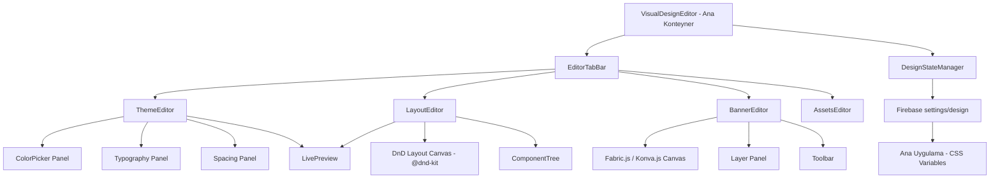
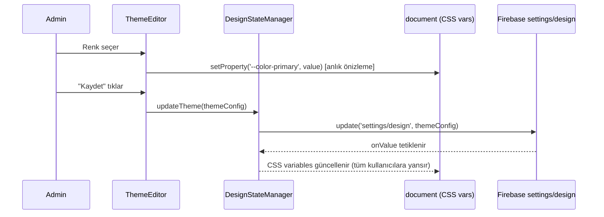
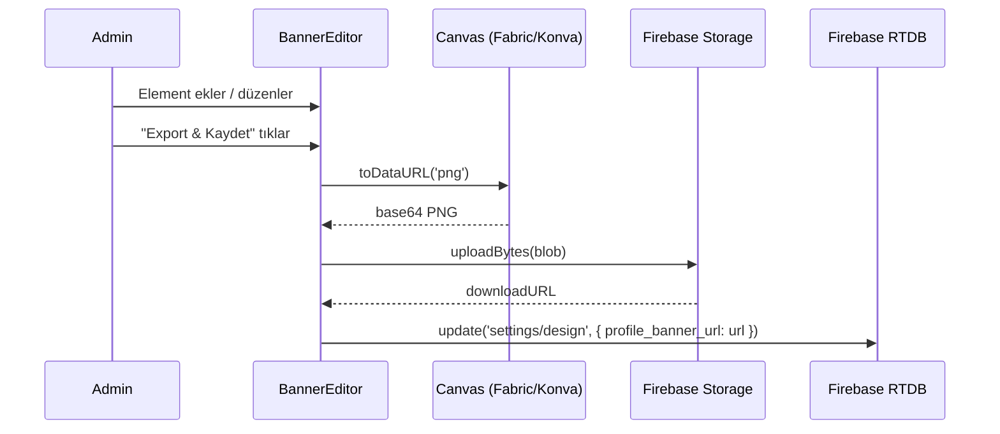
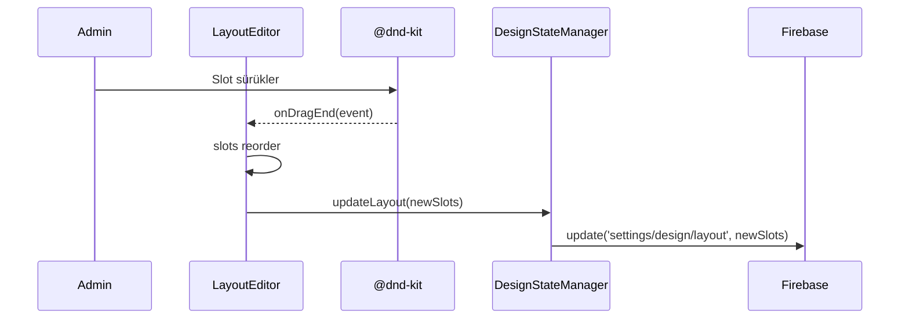

# Design Document: Visual Design Editor

## Overview

Nature.co backoffice paneline (`/backoffice/design`) entegre edilecek, Canva/Photoshop benzeri görsel bir editör. Mevcut `DesignSettingsModule.tsx` dosyasının yerini alacak; drag & drop canvas, layout editörü, tema/renk editörü ve banner editörünü tek bir arayüzde birleştirecek. Tüm değişiklikler Firebase `settings/design` path'ine kaydedilecek ve ana uygulamaya gerçek zamanlı yansıyacak.

## Architecture



## Components and Interfaces

### Component 1: VisualDesignEditor

**Purpose**: Tüm editör sekmelerini barındıran ana konteyner. Mevcut `DesignSettingsModule.tsx`'in yerini alır.

**Interface**:
```typescript
interface VisualDesignEditorProps {
  // RoleGuard zaten super_admin kontrolü yapıyor
}

type EditorTab = 'theme' | 'layout' | 'banner' | 'assets'
```

**Responsibilities**:
- Sekme navigasyonu yönetimi
- Global `DesignState`'i Firebase'den yükleyip sağlamak
- Kaydet / Geri Al (undo/redo) stack'i tutmak
- Audit log yazmak

---

### Component 2: ThemeEditor

**Purpose**: Renk, font, spacing ve border-radius ayarlarını canlı önizleme ile düzenleme.

**Interface**:
```typescript
interface ThemeConfig {
  primary_color: string       // hex
  bg_color: string            // hex veya gradient string
  bg_style: 'dark' | 'gradient' | 'deep' | 'custom'
  font_size: number           // px
  font_family: string         // CSS font-family
  border_radius: number       // px
  sidebar_color: string
  accent_color: string
  text_color: string
}
```

**Responsibilities**:
- Renk seçici (native `<input type="color">` + hex input)
- Anlık CSS variable güncellemesi (`document.documentElement.style.setProperty`)
- Mevcut tema presetlerini (`src/constants/themes.tsx`) listeleme ve uygulama
- Logo URL ve favicon URL alanları (mevcut işlevsellik korunur)

---

### Component 3: LayoutEditor

**Purpose**: Sidebar, header, chat alanı gibi ana layout bileşenlerinin konumunu drag & drop ile değiştirme.

**Interface**:
```typescript
interface LayoutSlot {
  id: 'sidebar' | 'channel-sidebar' | 'chat-area' | 'header' | 'footer'
  label: string
  position: 'left' | 'right' | 'top' | 'bottom' | 'hidden'
  width?: number   // px veya %
  order: number    // flex order
}

interface LayoutConfig {
  slots: LayoutSlot[]
  sidebarWidth: number
  channelSidebarWidth: number
  headerHeight: number
}
```

**Responsibilities**:
- `@dnd-kit/core` + `@dnd-kit/sortable` ile sürükle-bırak
- Değişiklikleri `settings/design/layout` path'ine kaydetme
- Ana uygulamanın layout'unu CSS variable'lar üzerinden güncelleme
- Mobil/masaüstü önizleme toggle'ı

---

### Component 4: BannerEditor

**Purpose**: Profil banner ve sunucu kapak görseli için Canva benzeri canvas editörü.

**Interface**:
```typescript
type BannerType = 'profile_banner' | 'server_cover'

interface BannerElement {
  id: string
  type: 'image' | 'text' | 'shape' | 'gradient'
  x: number
  y: number
  width: number
  height: number
  rotation: number
  opacity: number
  zIndex: number
  props: ImageProps | TextProps | ShapeProps | GradientProps
}

interface BannerConfig {
  type: BannerType
  width: number
  height: number
  elements: BannerElement[]
  background: string
  exportUrl?: string   // Firebase Storage'a yüklenen son export
}
```

**Responsibilities**:
- Fabric.js veya Konva.js canvas render
- Element ekleme: görsel (URL), metin, şekil, gradient
- Seçili element için properties panel (boyut, renk, opacity, font)
- PNG olarak export edip Firebase Storage'a yükleme
- Yüklenen URL'yi `settings/design/profile_banner_url` veya `settings/design/server_cover_url`'e kaydetme

---

### Component 5: AssetsEditor

**Purpose**: Logo, favicon ve özel emoji yönetimi (mevcut `DesignSettingsModule` emoji bölümü buraya taşınır).

**Interface**:
```typescript
interface AssetConfig {
  logo_url: string
  favicon_url: string
  custom_emojis: Record<string, { name: string; value: string; addedBy: string }>
}
```

**Responsibilities**:
- Logo ve favicon URL girişi + önizleme
- Özel emoji ekleme/silme (mevcut işlevsellik korunur)

---

## Data Models

### DesignState (Firebase `settings/design`)

```typescript
interface DesignState {
  // Mevcut alanlar (geriye dönük uyumlu)
  primary_color?: string
  bg_color?: string
  font_size?: number
  border_radius?: number
  bg_style?: string
  logo_url?: string
  favicon_url?: string

  // Yeni alanlar
  theme?: ThemeConfig
  layout?: LayoutConfig
  banners?: {
    profile_banner?: BannerConfig
    server_cover?: BannerConfig
  }
  assets?: AssetConfig

  // Meta
  last_updated?: number
  updated_by?: string
}
```

**Validation Rules**:
- `primary_color`, `bg_color`, `accent_color`, `sidebar_color`, `text_color`: geçerli hex renk (`#RRGGBB`)
- `font_size`: 10–32 px arası
- `border_radius`: 0–24 px arası
- `sidebarWidth`: 48–320 px arası
- Banner `width`/`height`: pozitif tam sayı
- URL alanları: boş veya geçerli `https://` URL

---

## Sequence Diagrams

### Tema Değişikliği Akışı



### Banner Export Akışı



### Layout Drag & Drop Akışı



---

## Error Handling

### Hata Senaryosu 1: Firebase Yazma Hatası

**Koşul**: `update(ref(db, 'settings/design'), ...)` başarısız olur (ağ hatası, izin reddi).
**Yanıt**: Toast ile hata mesajı gösterilir. CSS variable değişiklikleri geri alınır (önceki değere dönülür).
**Kurtarma**: Kullanıcı tekrar "Kaydet" butonuna basabilir.

### Hata Senaryosu 2: Geçersiz Renk Değeri

**Koşul**: Kullanıcı hex input'a geçersiz değer girer (örn. `#ZZZZZZ`).
**Yanıt**: Input kırmızı border ile işaretlenir, kaydet butonu devre dışı bırakılır.
**Kurtarma**: Kullanıcı geçerli bir değer girer.

### Hata Senaryosu 3: Banner Export Hatası

**Koşul**: Canvas `toDataURL()` veya Firebase Storage upload başarısız olur.
**Yanıt**: Toast ile hata gösterilir. Önceki banner URL korunur.
**Kurtarma**: Kullanıcı tekrar export edebilir.

### Hata Senaryosu 4: Büyük Görsel Yükleme

**Koşul**: Yüklenen görsel 5MB'ı aşıyor.
**Yanıt**: Upload öncesinde client-side boyut kontrolü yapılır, hata toast'u gösterilir.
**Kurtarma**: Kullanıcı daha küçük bir görsel seçer.

---

## Testing Strategy

### Unit Testing Approach

- `ThemeEditor`: Renk değişikliğinin doğru CSS variable'ı güncellediğini test et.
- `LayoutEditor`: `onDragEnd` sonrası slot sıralamasının doğru güncellendiğini test et.
- `DesignStateManager`: Firebase'e yazılan verinin beklenen şemaya uyduğunu test et.
- Validation fonksiyonları: hex renk, URL, sayısal aralık validasyonları için birim testler.

### Property-Based Testing Approach

**Property Test Library**: `vitest` + `fast-check`

- **Renk validasyonu**: Rastgele string'lerin hex renk validasyonundan geçip geçmediği tutarlı olmalı.
- **Layout slot sıralaması**: Herhangi bir drag & drop sonrası tüm slot'ların listede tam olarak bir kez bulunması gerekir.
- **DesignState merge**: Kısmi güncelemelerin mevcut state'i bozmadan birleştirilmesi gerekir.

### Integration Testing Approach

- Firebase emülatörü ile `settings/design` okuma/yazma döngüsü.
- Ana uygulamanın `onValue` listener'ının tasarım değişikliklerini doğru CSS variable'lara yansıttığını doğrulama.
- `RoleGuard` ile `super_admin` dışındaki rollerin editöre erişemediğini doğrulama.

---

## Performance Considerations

- **Debounce**: Renk picker'dan gelen anlık değişiklikler Firebase'e yazılmaz; 500ms debounce uygulanır. CSS variable güncellemesi anlık kalır.
- **Lazy Loading**: `BannerEditor` (Fabric.js/Konva.js) ağır bir bağımlılık olduğundan `React.lazy()` ile yüklenir; sekmeye ilk geçişte indirilir.
- **Canvas Boyutu**: Banner canvas'ı maksimum 1920×600px ile sınırlandırılır. Export sırasında `quality: 0.85` JPEG veya PNG kullanılır.
- **Firebase Okuma**: `onValue` listener tek bir `settings/design` path'ini dinler; gereksiz alt path dinleyicilerinden kaçınılır.

---

## Security Considerations

- **RoleGuard**: Tüm editör `super_admin` rolü ile korunur (mevcut `RoleGuard` bileşeni kullanılır).
- **URL Validasyonu**: Logo, favicon ve görsel URL'leri `https://` ile başlamalı; `javascript:` ve `data:` protokolleri reddedilir.
- **Firebase Rules**: `settings/design` path'i sadece `backoffice_role === 'super_admin'` olan kullanıcılara yazma izni verir (mevcut `database.rules.json` genişletilir).
- **XSS**: Kullanıcıdan alınan metin değerleri (banner metin elementi) canvas'a render edilmeden önce sanitize edilir.
- **Audit Log**: Her kaydetme işlemi `writeAuditLog` ile kaydedilir (mevcut pattern korunur).

---

## Dependencies

| Paket | Versiyon | Amaç |
|---|---|---|
| `@dnd-kit/core` | ^6.x | Layout editörü drag & drop |
| `@dnd-kit/sortable` | ^8.x | Slot sıralama |
| `fabric` | ^6.x | Banner canvas editörü (tercih) |
| `konva` + `react-konva` | ^9.x | Fabric.js alternatifi |
| `firebase` | ^11.x (mevcut) | RTDB + Storage |
| `lucide-react` | mevcut | İkonlar |
| `motion` | mevcut | Animasyonlar |

> **Not**: Fabric.js ve Konva.js arasındaki seçim implementasyon aşamasında yapılacak. Fabric.js daha olgun bir API sunarken, Konva.js React ile daha iyi entegre olur. İkisi de aynı `BannerEditor` arayüzünü karşılar.

---

## Correctness Properties

*A property is a characteristic or behavior that should hold true across all valid executions of a system — essentially, a formal statement about what the system should do. Properties serve as the bridge between human-readable specifications and machine-verifiable correctness guarantees.*

### Property 1: Geriye Dönük Uyumluluk (Round-Trip)

*For any* DesignState object containing legacy fields (`primary_color`, `bg_color`, `font_size`, `border_radius`, `bg_style`, `logo_url`, `favicon_url`), writing that state to Firebase via DesignStateManager and then reading it back should produce an equivalent object with all legacy fields intact.

**Validates: Requirements 6.1**

### Property 2: CSS Variable Anlık Güncelleme

*For any* valid hex color value, when ThemeEditor updates a color field, the corresponding CSS variable on `document.documentElement` should reflect the new value immediately — both during live editing and after a Firebase `settings/design` change event.

**Validates: Requirements 2.2, 6.4, 8.2**

### Property 3: Partial Write Atomikliği

*For any* DesignState and any single editor section (ThemeEditor, LayoutEditor, AssetsEditor), saving changes from that section should leave all other sections of DesignState unchanged in Firebase.

**Validates: Requirements 2.10, 3.6, 6.2**

### Property 4: Rol Koruması

*For any* user whose `backoffice_role` is not `super_admin`, the VisualDesignEditor should not render its content and should not allow any Firebase write to `settings/design`.

**Validates: Requirements 1.3**

### Property 5: Layout Slot Bütünlüğü

*For any* list of LayoutSlots and any drag-and-drop operation, the resulting slot list should contain each original slot's `id` exactly once — no slot should be lost or duplicated.

**Validates: Requirements 3.3, 3.4**

### Property 6: Renk Validasyonu Tutarlılığı

*For any* string input to a color field, the validation result should be consistent: strings matching `#[0-9A-Fa-f]{6}` should be accepted, all others should be rejected and trigger an error indicator that disables the save button.

**Validates: Requirements 2.3, 2.4, 6.5**

### Property 7: Sayısal Aralık Validasyonu

*For any* numeric value provided to `font_size`, `border_radius`, or `sidebarWidth`, the DesignStateManager should clamp or reject values outside their allowed ranges (font_size: 10–32, border_radius: 0–24, sidebarWidth: 48–320) before writing to Firebase.

**Validates: Requirements 2.6, 3.7, 6.6**

### Property 8: URL Validasyonu

*For any* string provided to a URL field (`logo_url`, `favicon_url`, image URLs), the DesignStateManager should accept only empty strings or strings starting with `https://`, rejecting all other values before writing to Firebase.

**Validates: Requirements 2.9, 6.7**

### Property 9: Dosya Boyutu Reddi

*For any* file selected for upload in BannerEditor, if the file size exceeds 5 MB, the upload should be rejected client-side before any network request is made, and the existing banner URL in DesignState should remain unchanged.

**Validates: Requirements 4.8**

### Property 10: Audit Log Yazma

*For any* save or emoji mutation operation performed by a super_admin, an AuditLog entry should be written — no save action should complete without a corresponding audit log record.

**Validates: Requirements 1.5, 5.6**
